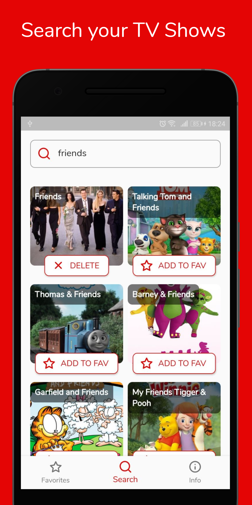
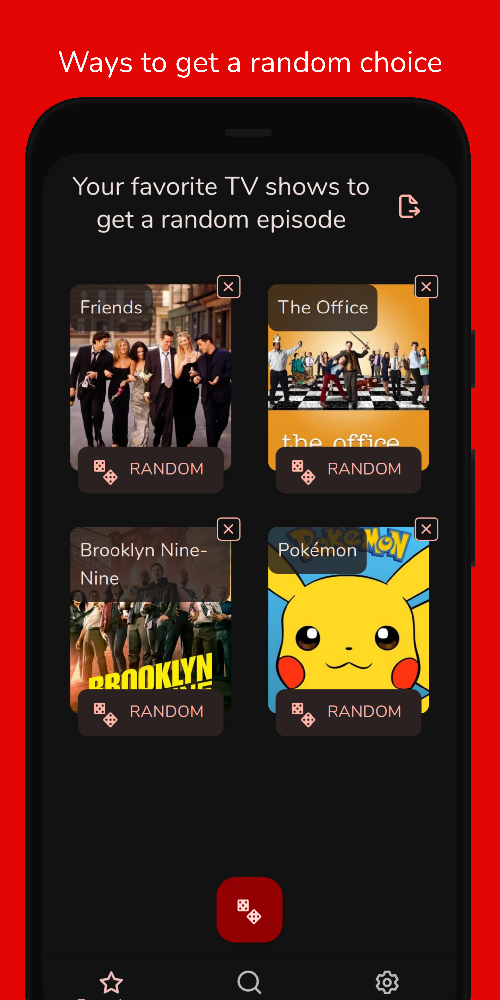
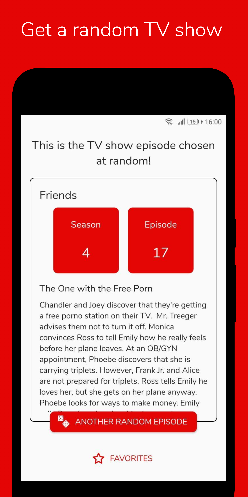
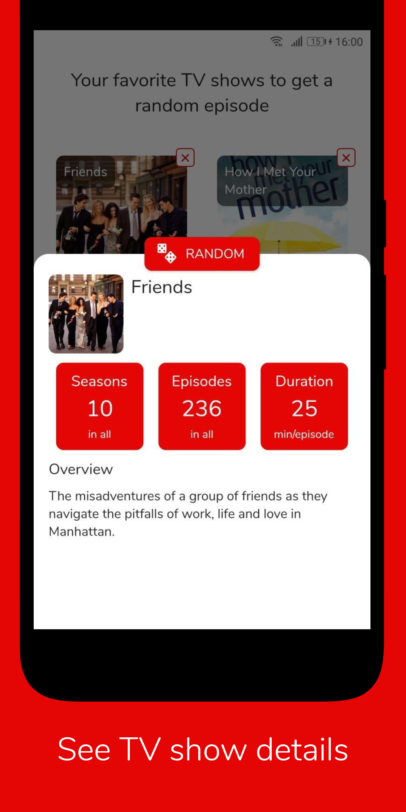
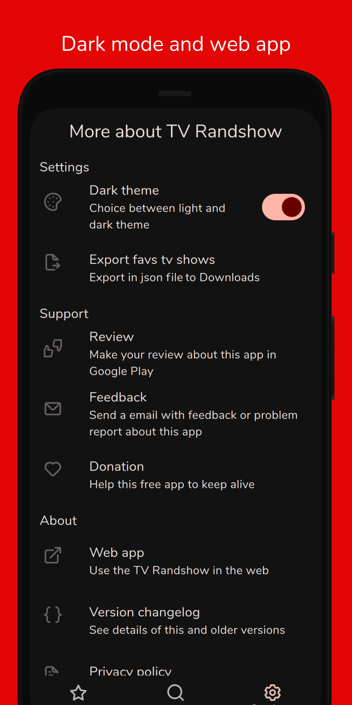

  
  

## TV Randshow - App to choose a random TV show episode

### About the project

TV Randshow was created to help choose a random episode from your favorites TV shows.
The TV shows database comes from the TMDB and the app saves them in a database on the device. With the list of favorites, you can roll the dice of a TV show to get a random episode.

This project has been built using the [Flutter](https://flutter.dev/) framework, which allows to build an multiplatform app from a single codebase.

  
  
  
  
  

## Features

- **Save your favorites TV shows with available streamings links**
- **Choose a random episode from a single TV show**
- **Support to Android and Web**
- **Dark mode**
- **Material 3**
- **Support to deeplink `https://tvrandshow.com/getRandomEpisode?tvshow=friends`**
- **Roadmap in [public Trello](https://trello.com/b/ib0jdUzK)**

## Build and run

### Requirements

1. Clone repository with 'git clone' command or just download the zip. `git clone git@github.com:deandreamatias/tv-randshow.git`
2. Prepare your develop enviroment
   1. Flutter (see version in ./fvm/fvm_config.json). Use [FVM](https://fvm.app/docs/getting_started/installation) to install Flutter versions
   2. When build to iOS, follow [this steps](https://docs.flutter.dev/get-started/install/macos#install-xcode)
   3. When build to Android, follow [this steps](https://docs.flutter.dev/get-started/install/macos#install-android-studio)
   4. (Recommended) [Just](https://github.com/casey/just) to use commands
3. Install dependencies and generate code
   1. Only use `just setup`
   2. If don't have just, can do manual proccess
      1. Run `flutter pub get` from the project root (see [using packages documentation](https://flutter.dev/docs/development/packages-and-plugins/using-packages#adding-a-package-dependency-to-an-app) for details and how to do this in the editor).
      2. Run `flutter pub run build_runner build`
4. Get your API Key from TMDB (see [this FAQ](https://www.themoviedb.org/faq/api) for more details) and paste in file `lib/config/env.dart`
5. Get your APi Key from Streaming Availabilty (on [RapidApi](https://rapidapi.com/movie-of-the-night-movie-of-the-night-default/api/streaming-availability)) and paste in file `lib/config/env.dart`
6. (Optional) If you want build to web, do you need follow [this steps](https://flutter.dev/docs/get-started/web)

### Run

Run `just run dev DEVICE_ID` command or copy the command from `./justfile`

### Tests

Integration tests (only mobile): run `just integration-test TMDB_API_KEY STREAMING_API_KEY DEVICE_ID` command or copy the command from `./justfile`
Unit tests: run `just unit-test TMDB_API_KEY STREAMING_API_KEY` command or copy the command from `./justfile`

> Replace screaming snake case with your values

## Author

- **Matias de Andrea** - Mobile developer: [Website](https://deandreamatias.com) and [GitHub](https://github.com/deandreamatias)

## Contributing

If you want to take the time to make this project better, please read the [contributing guides](https://github.com/deandreamatias/tv-randshow/blob/master/CONTRIBUTING.md) first. Then, you can open an new [issue](https://github.com/deandreamatias/tv-randshow/issues/new/choose), of a [pull request](https://github.com/deandreamatias/tv-randshow/compare).

## License

This project is licensed under the GNU GPL v3 License - see the [LICENSE](LICENSE) file for details.
